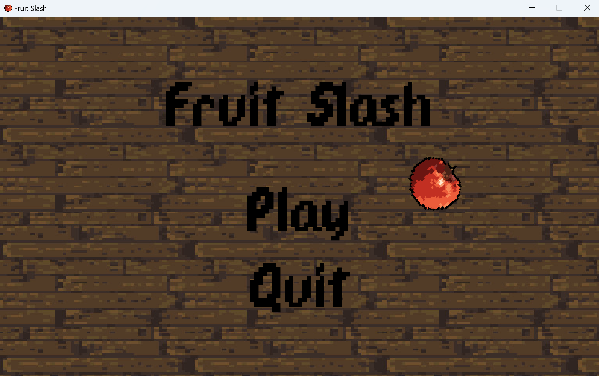
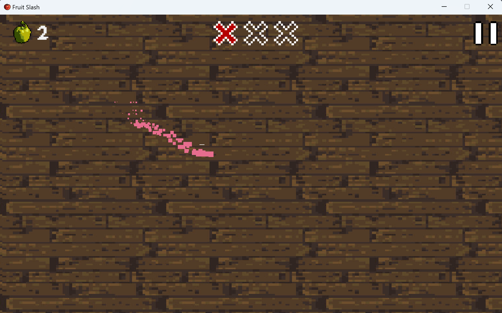
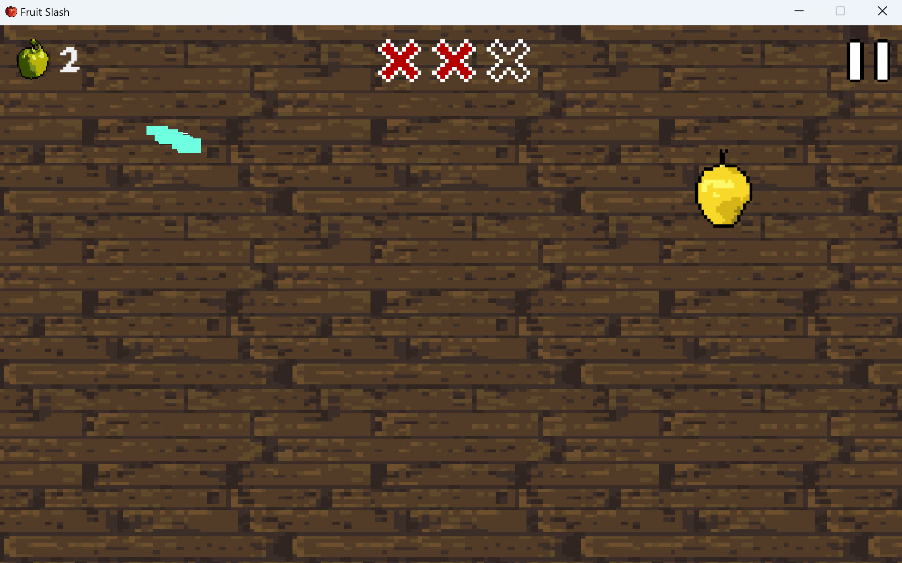
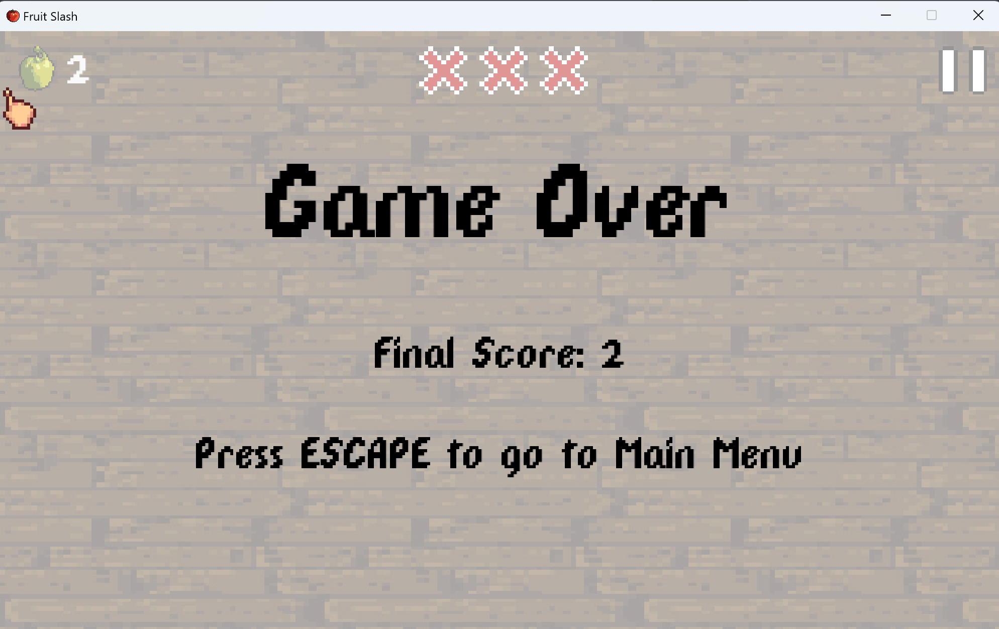

# Fruit Ninja
This is a basic version of Fruit Ninja. The objective is to slash the fruits and ignore the bombs.

The control keys are:
- "mouse"

Used libraries:
- pygame
- random
- json

## Setup

Pre-requirements:

* python 3.9 >

## Download
[game.zip](https://github.com/user-attachments/files/17467296/game.zip)

## Screenshots

